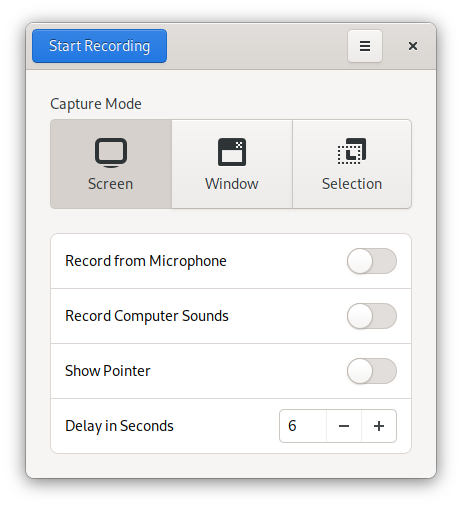
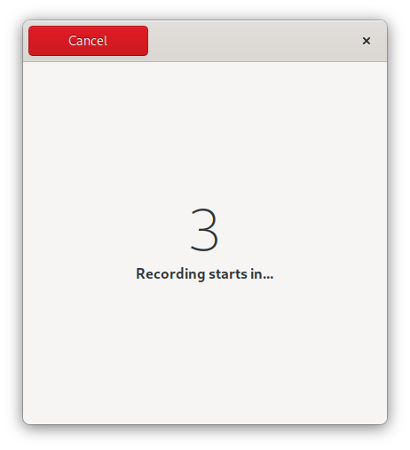

<h1 align="center">
	<br>
	RecApp
</h1>


<p align="center"><strong>Simple Screencasting Application</strong></p>

<p align="center">
  <a href="https://flathub.org/apps/details/com.github.amikha1lov.RecApp"></a>
</p>

<p align="center">
  
</p>

<p align="center">
  
</p>

<p align="center">
  
</p>


## Description
A user-friendly and open-source screencast application for Linux written in GTK using free GStreamer modules instead of FFmpeg.


## Packaging status

[Fedora](https://src.fedoraproject.org/rpms/recapp): `sudo dnf install recapp`

[openSUSE Tumbleweed && openSUSE Leap 15.2 One-click installation](https://software.opensuse.org//download.html?project=GNOME%3AApps&package=recapp)


## Build from source

```
git clone https://github.com/amikha1lov/RecApp.git
cd RecApp
git submodule update --init --recursive
mkdir -p $HOME/Projects/flatpak/repo
flatpak-builder --repo=$HOME/Projects/flatpak/repo --force-clean --ccache build-dir com.github.amikha1lov.RecApp.yaml
flatpak remote-add --no-gpg-verify local-repo $HOME/Projects/flatpak/repo
flatpak install local-repo com.github.amikha1lov.RecApp
```

## Credits

Design inspired by **[GNOME Screenshot](https://gitlab.gnome.org/GNOME/gnome-screenshot/)**.
The [chime](https://soundbible.com/1598-Electronic-Chime.html) used is under the Public Domain.
